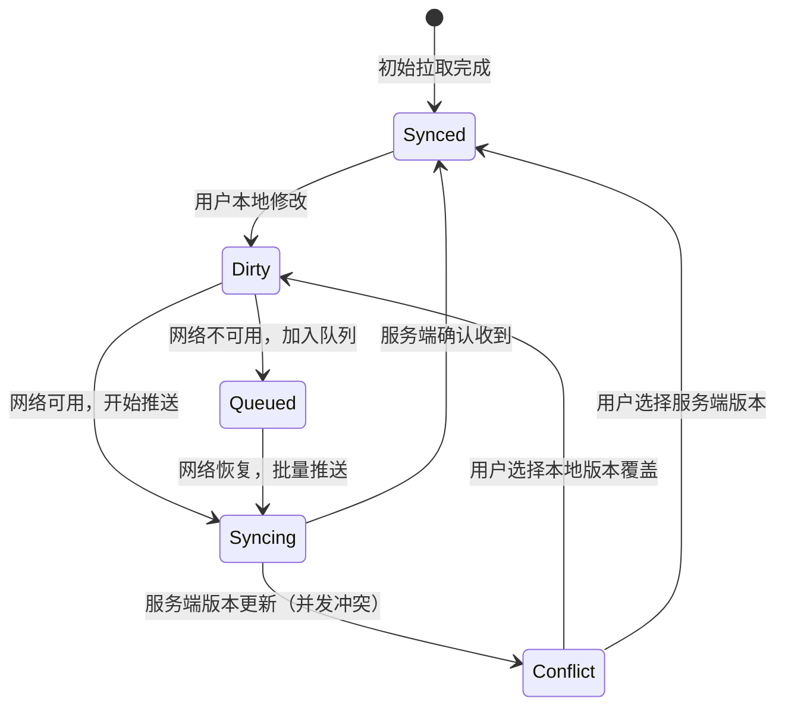

# TODO List 产品需求文档 (PRD) v3.0
## 云端多用户 + 离线优先生产级架构

---

## 1. 项目概述

**一句话描述**：一款支持多终端实时同步的离线优先任务管理应用，采用 CRDT -lite 冲突解决策略，确保用户在极端弱网环境下仍可完整管理任务，联网后实现毫秒级数据融合。

**核心架构亮点**：
- **离线优先 (Offline-First)**：100% 功能在无网络环境下可用
- **实时同步**：基于 WebSocket 的增量同步（<100ms 延迟）
- **数据主权**：用户完全拥有数据，支持完整导出/迁移
- **多租户隔离**：行级安全策略 (RLS) 确保严格数据隔离

---

## 2. 目标用户与使用场景

| 用户画像 | 典型场景 | 核心需求 |
|---------|---------|---------|
| **数字游民** | 飞机上整理任务→落地自动同步到手机/电脑 | 离线可用、跨端无缝 |
| **敏捷团队** | 5人小团队共享项目看板，实时看到队友进度更新 | 协作同步、权限管控 |
| **重度效率用户** | 每日处理 30+ 任务，需严格优先级和标签管理 | 高性能、复杂筛选 |

---

## 3. 核心功能列表

### 🔴 Must Have（核心交付）
| 功能域 | 具体功能 | 验收标准 |
|-------|---------|---------|
| **身份认证** | 邮箱注册/登录、密码重置、JWT 会话管理、Token 自动刷新 | 支持"记住我"7天，支持主动登出所有设备 |
| **离线引擎** | IndexedDB 本地数据库、操作队列化、后台自动同步、网络状态检测 | 断网时所有操作零延迟响应，联网后 3 秒内完成同步 |
| **实时协作** | WebSocket 实时订阅、增量更新广播、在线状态指示 | 多设备同时在线时，A 设备修改后 B 设备 500ms 内可见 |
| **冲突解决** | 基于 LWW + Vector Clock 的自动合并、冲突告警 UI | 同时编辑同一任务时，系统保留两个版本供用户选择 |
| **数据安全** | RLS 行级安全、输入 XSS 过滤、SQL 注入防护 | 用户 A 无法通过 API 获取用户 B 的任何任务元数据 |
| **灾难恢复** | 数据导出(JSON/CSV)、软删除恢复(30天垃圾箱)、版本快照 | 误删后可一键恢复，支持完整数据迁移 |

### 🟡 Nice to Have（第二阶段）
| 功能域 | 描述 |
|-------|------|
| **社交登录** | Google/GitHub OAuth、SSO 企业登录 |
| **协作空间** | 团队 Workspace、角色权限(RBAC)、任务指派 |
| **端到端加密** | 敏感任务端到端加密(E2EE)，服务端无法解密 |
| **AI 增强** | 智能任务拆分建议、自然语言日期解析("下周一") |
| **PWA 强化** | 推送通知、后台同步(Background Sync API)、桌面安装 |

---

## 4. 数据模型设计

### 用户表 (users)
```typescript
interface User {
  id: uuid;                    // Supabase Auth 提供的 UUID
  email: string;               // 唯一索引
  encrypted_password?: string; // Supabase Auth 托管
  
  profile: {
    nickname: string;
    avatar_url?: string;
    timezone: string;          // 用于日期渲染，默认 Intl 自动检测
  };
  
  settings: {
    default_filter: 'all' | 'today' | 'week';
    theme: 'system' | 'light' | 'dark';
    auto_archive: boolean;     // 自动归档已完成任务
    conflict_resolution: 'manual' | 'auto_lww'; // 用户偏好的冲突策略
  };
  
  security: {
    last_sign_in_at: timestamp;
    mfa_enabled: boolean;      // 预留多因素认证
    device_grants: DeviceGrant[]; // 已登录设备列表
  };
  
  created_at: timestamp;
  updated_at: timestamp;
}
```

### 任务表 (tasks) - 多租户 + 同步元数据
```typescript
interface Task {
  // 主键与归属
  id: uuid;                    // 全局唯一 (CUID2 或 UUIDv7)
  user_id: uuid;               // RLS 策略核心字段，不可修改
  
  // 业务数据
  title: string;               // 限制 200 字符，XSS 过滤
  description?: string;        // 富文本（ProseMirror/Tiptap 格式）
  priority: 1 | 2 | 3 | 4;     // 1=紧急 2=高 3=中 4=低，数字便于排序
  status: 'todo' | 'in_progress' | 'done' | 'archived';
  
  // 组织
  tags: string[];              // GIN 索引，支持标签筛选
  project_id?: uuid;           // 可选的项目分组
  parent_id?: uuid;           // 子任务支持（自引用外键）
  sort_order: number;          // 手动排序权重（浮点数支持中间插入）
  
  // 时间
  due_date?: timestamp;        // 截止日期（无时区，本地解析）
  due_time?: time;             // 可选的具体时间
  reminder_at?: timestamp;     // 提醒时间
  
  // 同步与版本控制（核心）
  created_at: timestamp;       // 服务端创建时间（不可变）
  updated_at: timestamp;       // 服务端最后修改
  vector_clock: {              // 冲突检测向量时钟
    [device_id: string]: number;
  };
  checksum: string;            // 内容哈希，快速比对变更
  
  // 软删除与归档
  is_deleted: boolean;       // 软删除标记（垃圾箱机制）
  deleted_at?: timestamp;      // 自动清理 30 天旧数据
  archived_at?: timestamp;    // 归档时间
}
```

### 同步日志表 (sync_logs) - 用于审计与调试
```typescript
interface SyncLog {
  id: uuid;
  user_id: uuid;
  device_id: string;           // 设备指纹
  operation: 'push' | 'pull' | 'conflict';
  changes_count: number;
  duration_ms: number;
  error?: string;
  created_at: timestamp;
}
```

### 本地存储 Schema (IndexedDB)
```typescript
// 使用 Dexie.js 库
class TodoDatabase extends Dexie {
  tasks!: EntityTable<Task, 'id'>;
  pending_queue!: EntityTable<PendingOperation, 'id'>;
  sync_state!: EntityTable<SyncState, 'user_id'>;
  blobs!: EntityTable<AttachmentBlob, 'id'>; // 预留附件缓存
  
  constructor() {
    super('TodoApp_v3');
    this.version(1).stores({
      tasks: 'id, user_id, status, priority, updated_at, [user_id+status]',
      pending_queue: 'id, timestamp, retry_count',
      sync_state: 'user_id, last_sync_at, cursor'
    });
  }
}

// 待同步操作队列
interface PendingOperation {
  id: string;                  // 操作 ID (ulid)
  type: 'CREATE' | 'UPDATE' | 'DELETE';
  table: 'tasks';
  payload: Partial<Task>;
  metadata: {
    original_timestamp: number; // 本地操作时间
    attempts: number;          // 重试次数
    priority: number;          // 同步优先级（用户主动同步>后台）
  };
}
```

---

## 5. 页面路由规划

| 路由 | 组件 | 权限 | 特性 |
|------|------|------|------|
| `/auth/login` | LoginPage | 公开 | 邮箱/密码、错误锁定机制 |
| `/auth/register` | RegisterPage | 公开 | 邮箱验证（可配置为可选） |
| `/auth/forgot` | ForgotPasswordPage | 公开 | 重置令牌 1 小时有效 |
| `/app` | Layout (Authenticated) | 需登录 | 底部/侧边导航，检查同步状态 |
| `/app/today` | TodayView | 需登录 | 今日到期任务，高优先级展示 |
| `/app/upcoming` | UpcomingView | 需登录 | 日历视图，时间轴排序 |
| `/app/projects` | ProjectsView | 需登录 | 项目分组管理 |
| `/app/task/:id` | TaskDetail | 需登录 + 所有权 | 编辑页，冲突检测提示 |
| `/app/settings` | Settings | 需登录 | 账户管理、数据导出、同步日志 |
| `/app/trash` | TrashView | 需登录 | 软删除恢复、永久删除 |

**导航守卫逻辑**：
- 检查 `access_token` 有效性（JWT 过期前自动刷新）
- 无 Token → 跳转 `/auth/login`（保留原始路由用于登录后重定向）
- Token 有效但本地无用户数据 → 显示 Loading 并拉取初始数据

---

## 6. 技术栈建议（生产级）

| 层级 | 技术选型 | 选型理由 |
|------|---------|---------|
| **后端即服务** | **Supabase** | PostgreSQL + Realtime + Auth + Storage 全包，可自托管避免锁定 |
| **前端框架** | **React 18 + TypeScript** | 并发特性优化高频更新（如实时协作时的任务状态闪变） |
| **状态管理** | **Zustand** (客户端状态) + **TanStack Query v5** (服务端状态) | 分离本地 UI 状态与远程同步状态，Query 的乐观更新完美匹配离线优先 |
| **本地数据库** | **Dexie.js** (IndexedDB 封装) | Promise 友好、支持复合索引、TypeScript 支持完善 |
| **实时同步** | **Supabase Realtime** | 基于 PostgreSQL 逻辑复制的官方方案，延迟低 |
| **冲突解决** | **Yjs** 或自研 Vector Clock | Yjs 提供成熟的 CRDT 实现，或自研轻量 LWW + 手动合并 UI |
| **UI 组件** | **Radix UI** (Headless) + **Tailwind CSS** | 无障碍支持完善，样式完全可控 |
| **富文本** | **Tiptap** (TipTap) | 基于 ProseMirror，支持协同编辑扩展（第二阶段） |
| **打包工具** | **Vite** + **PWA Plugin** | 快速 HMR，自动生成 Service Worker |
| **测试** | **Vitest** (单元) + **Playwright** (E2E) | 同步逻辑需充分测试，Playwright 可模拟离线场景 |

---

## 7. 同步架构详解（核心工程）

### 7.1 架构模式：Offline-First with Sync Engine

```typescript
// 架构分层
[UI Layer] → [Local State (Zustand)] → [Local DB (IndexedDB)] → [Sync Engine]
                                               ↓
[Network Layer] ← [Supabase Client] ← [WebSocket / REST]
```

**黄金法则**：
1. **读取路径**：总是先读 IndexedDB，后台静默刷新
2. **写入路径**：先写 IndexedDB 并标记 `pending`，UI 立即响应，后台异步推送
3. **冲突避免**：使用 `vector_clock` 检测并发修改，而非简单时间戳

### 7.2 同步状态机


### 7.3 冲突解决策略（详细实现）

当检测到冲突（云端 `vector_clock` 非后代节点）时：

**策略 A：自动合并（简单字段）**
- `status` 变化：取最新状态（状态机单向推进）
- `title/description` 变化：若不同，标记为冲突需人工合并

**策略 B：手动合并 UI（复杂字段）**
显示三栏对比：
```
[本地版本] | [云端版本] | [合并结果（可编辑）]
```

**策略 C：操作转换（OT）for 富文本**
使用 ProseMirror 的 Step 映射，尝试自动合并编辑操作（第二阶段）。

### 7.4 关键代码架构（伪代码）
```typescript
// hooks/useTask.ts - 业务层 hook
export function useTask(taskId: string) {
  const queryClient = useQueryClient();
  
  return useQuery({
    queryKey: ['task', taskId],
    queryFn: async () => {
      // 1. 立即返回本地缓存
      const local = await db.tasks.get(taskId);
      
      // 2. 后台检查更新
      if (navigator.onLine) {
        syncEngine.pullSingle(taskId).then(serverTask => {
          if (serverTask.checksum !== local?.checksum) {
            // 检测到更新，触发 React Query 重新渲染
            queryClient.setQueryData(['task', taskId], serverTask);
          }
        });
      }
      
      return local;
    },
    staleTime: Infinity, // 我们手动控制刷新
  });
}

// lib/sync/SyncEngine.ts
class SyncEngine {
  async push() {
    const pending = await db.pending_queue
      .orderBy('metadata.priority')
      .toArray();
    
    for (const op of pending) {
      try {
        // 乐观锁：携带本地 vector_clock
        const { data, error } = await supabase.rpc('apply_operation', {
          op: op,
          client_vector_clock: op.payload.vector_clock
        });
        
        if (error?.code === 'CONCURRENT_MODIFICATION') {
          await this.handleConflict(op, error.expected_version);
        } else {
          await db.pending_queue.delete(op.id);
          await db.tasks.update(op.payload.id, {
            ...data,
            sync_status: 'synced'
          });
        }
      } catch (e) {
        if (op.metadata.attempts > 5) {
          await this.moveToDeadLetterQueue(op); // 人工介入
        } else {
          await db.pending_queue.update(op.id, {
            'metadata.attempts': op.metadata.attempts + 1
          });
        }
      }
    }
  }
  
  subscribeToRealtime() {
    return supabase
      .channel(`user-${userId}`)
      .on('postgres_changes', 
        { event: '*', schema: 'public', table: 'tasks', filter: `user_id=eq.${userId}` },
        (payload) => {
          // 收到服务端推送，更新本地
          this.handleServerChange(payload);
        }
      )
      .subscribe();
  }
}
```

---

## 8. 开发迭代计划（2 周版本）

### Week 1：基础架构与离线核心
| 天数 | 任务 | 产出物 |
|------|------|--------|
| Day 1 | 环境搭建 + Supabase 配置 | 可运行的空壳应用，Auth 配置完成 |
| Day 2 | 本地数据库层 | Dexie Schema 定义，CRUD 封装完成，支持 IndexedDB 调试 |
| Day 3 | 认证系统 | 登录/注册/忘记密码页面，路由守卫，Token 刷新机制 |
| Day 4 | 任务 CRUD + 离线队列 | 可创建任务并存储本地，断网时自动入队 |
| Day 5 | 基础同步引擎 | 联网时自动推送，简单错误重试 |
| Day 6-7 | 周末测试与修复 | 模拟 3G/断网/恢复场景，修复数据丢失 bug |

### Week 2：实时同步与打磨
| 天数 | 任务 | 产出物 |
|------|------|--------|
| Day 8 | Supabase Realtime 集成 | 多设备实时看到更新 |
| Day 9 | 冲突检测与解决 UI | 冲突提示弹窗，手动合并界面 |
| Day 10 | 垃圾箱与软删除 | 删除进入 Trash，30 天清理，支持恢复 |
| Day 11 | 数据导出与导入 | JSON/CSV 导出，JSON 导入（含冲突处理） |
| Day 12 | PWA 与优化 | Service Worker 缓存，安装提示，性能优化 |
| Day 13 | E2E 测试 | Playwright 编写核心流程测试（登录→创建→同步→离线→恢复） |
| Day 14 | 文档与部署 | 编写 README，部署到 Vercel，配置生产环境 Supabase |

---

## 9. 性能指标 (SLO)

| 指标 | 目标值 | 测试方法 |
|------|--------|---------|
| **首屏加载** | < 1.5s (3G) | Lighthouse |
| **离线操作延迟** | < 50ms | 性能面板测量 IndexedDB 写入 |
| **同步延迟** | < 500ms (WiFi) | 模拟两个浏览器窗口，A 修改后 B 可见时间 |
| **冲突检测准确率** | > 99% | 自动化测试模拟并发编辑 |
| **数据持久性** | 0 丢失 | 断电测试（kill 应用后重启检查） |

---

## 10. 风险与缓解策略

| 风险 | 可能性 | 缓解措施 |
|------|--------|---------|
| 同步逻辑复杂导致数据丢失 | 中 | 1. 软删除永不硬删<br>2. 每日自动备份到本地文件<br>3. 提供"修复数据"工具页 |
| IndexedDB 容量限制（~50MB） | 低 | 任务文本数据极小，50MB 可容纳 10 万+ 任务，超标时自动归档旧数据 |
| 浏览器隐私模式导致存储失败 | 中 | 检测 Safari/Incognito 模式，降级为内存存储并提示用户 |
| Supabase 免费层限制（500MB） | 低 | 添加存储监控，接近阈值时提醒用户清理或升级 |

---

